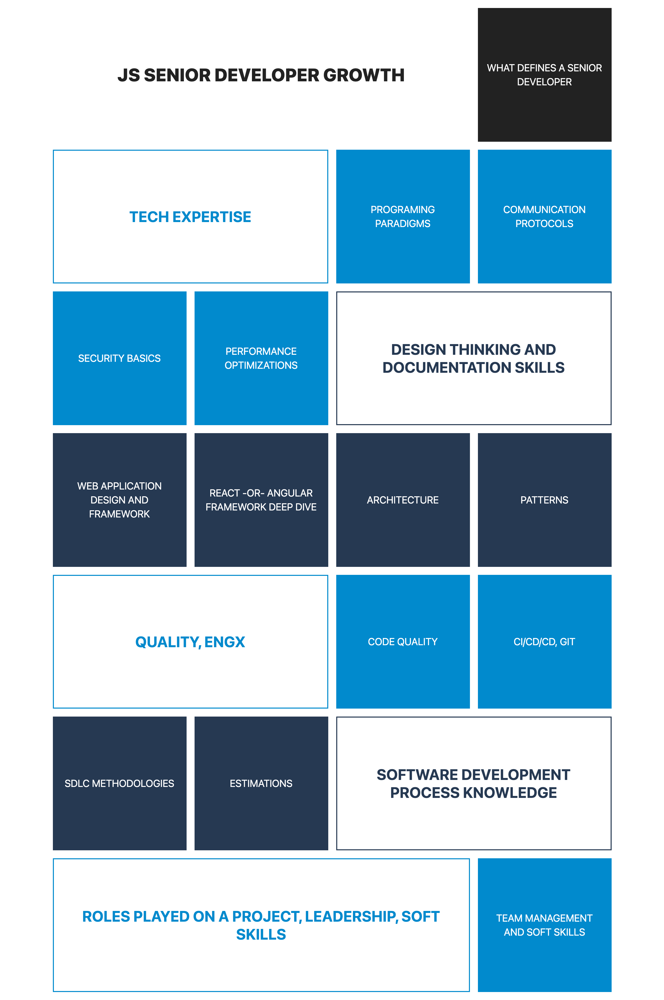

# JS SENIOR DEVELOPER GROWTH

## HTML + Tailwind CSS

## Modules
1. WHAT DEFINES A SENIOR DEVELOPER

### TECH EXPERTISE

2. Programing Paradigms

3. Communication Protocol & Security Basics

4. Security Basics

5. Performance Optimizations

### DESIGN THINKING AND DOCUMENTATION SKILLS

6. Web Application Design and Framework

7. React -OR- Angular framework deep dive

8. Architecture

9. Patterns

### QUALITY, ENGX

10. Code quality

11. CI/CD/CD, GIT

### SOFTWARE DEVELOPMENT PROCESS KNOWLEDGE

12. SDLC Methodologies

13. Estimations

### ROLES PLAYED ON A PROJECT, LEADERSHIP, SOFT SKILLS

14. Team management and Soft Skills